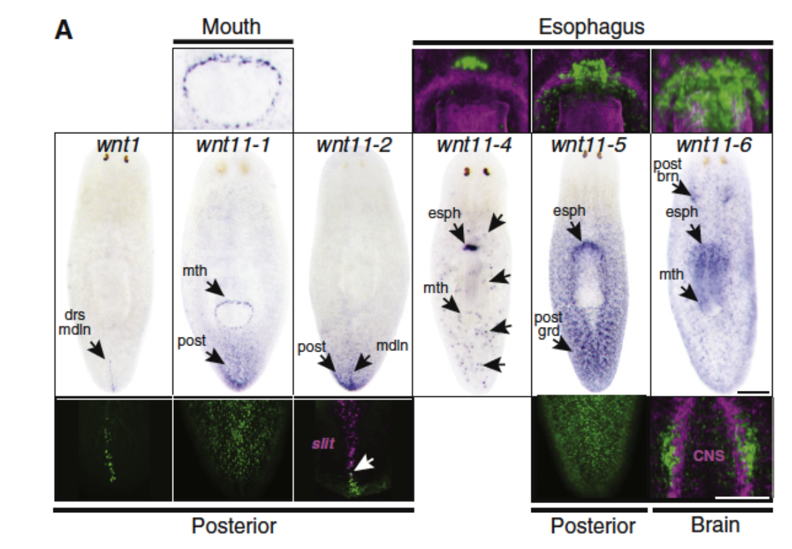

# PAGE Curation Rules 
__What we curated:__ wildtype intact expression data  
__What was beyond the scope:__ wildtype regeneration time course expression data; gene expression in RNAi backgrounds or other experimental perturbations, any antibody data
1.  __Only record expression in homeostatic, wildtype animals__
     - Example: PMID 26525673 only uses trpA and serT + neurons in figure S10, however all panels in this figure are for animals that were amputated so they are not included because of the experimental perturbation.   
2.  __For any transcripts identified in the text by a name ( Wnt, FoxA, etc), locate an accession number (if reported) and input annotations with the accession number.__
     - If there is not an accession number available, use any reference ID used in the manuscript corresponding to a transcript or EST. 
     - If another paper is cited for a transcript ID, go to that paper and get the appropriate ID.
     - If primers were the only identification provided, these were used to determine a SMED3000 id that corresponds using BLASTn on Planosphere.stowers.org 
     - A genomic contig also suffices. 
     - If you can’t do any of the above, report the transcript name as reported in the text. 
     - **DO NOT annotate antibody localization (protein)**
3. __Create records based only on text written by authors.__
     - This includes figure legends and supplemental figure legends. 
     - **Do NOT** look at figure panels and try to describe an in situ pattern of your own accord as we are relying on authors expertise reporting their data rather than introducing external bias.  
     - If a figure uses text to highlight an area of expression, it should be included, as in PMID 2070997 Fig2, where the abbreviated structures in the middle panel were included because they are elaborated on in the figure legend. Specifically drs midline = dorsal midline and wnt1 was then noted as being expressed in the dorsal midline by colorimetric WISH. 

4. __Vague descriptions of expression patterns in the text may be omitted if there isn't clear information about what the anatomical structure is.__
    - e.g., "discrete cells" or "discrete subepidermal cells" cannot be annotated. 
    - “Neoblast-like cell” was annotated as “parenchymal cell”
    - PMID:22445864 “discrete TOR-positive cells are found in close association with the brain” 
    - PMID: 26525673 “wnt11-6 has prominent expression in the posterior brain (Fig. 2A, magenta) in addition to dispersed cells throughout the body
    - PMID: 26525673 “expression of regionally restricted homeotic transcription factors (orthopedia, otp; orthodenticle B, otxB; orthodenticle A, otxA)”
    - PMID:2070997 “Eight of nine planarian wnt genes were expressed in discrete cells distributed throughout the adult body plan and most exhibited more than one domain of expression”
    - PMID:26711341 “Intriguingly,the MLL1/2-affected genes that presented the most biologically relevant expression patterns were those identified exclusively in X1 stem cells (‘‘X1-only’’); >60% (12/18) of genes screened from this list showed patterns of expression in ciliated tissues, including the outer epithelial layer, peripheral neurons, and pharynx.”  This accompanies a panel of in situs in a figure where express linkages between transcript and the ciliated tissues are not made therefore none are recorded. 

5. __"Ubiquitous expression" and equivalent terms are entered as ‘whole organism’__ 

6. __Only record positive expression.__
    - “Expressed in X, Y, Z but not in A,B,C.” should be annotated as expressed in ‘X’, ‘Y’ and ‘Z’
With no negating function, anatomical areas lacking expression are not recorded.

 7. __When the authors fail to detect or articulate a discrete pattern then there are no entries recorded for that transcript.__ 
     - Points X-X taken together describe important caveats in PAGE data that result in underreporting:  If authors do not (a)mention an expression pattern, (b) vaguely describe expression or (c) only describe areas that do not have expression  and still have an image in the text, then searching by pubmed id will not show that transcript as being a part of the expression data in that paper. 

 8. __Annotate with the most granular class.__ 
    - Example: “Transcript X is expressed in reproductive structures……” but later on the authors say “Transcript X is expressed in the ovaries”. Record transcript x as being expressed in the ’ovary’.  

 9. __Expression in a subset of class is considered as expressed in that class.__  
    - Example: “ Coe is expressed in a subset of cycling neoblasts.” Record as Coe is expressed in ‘neoblast’. 
    - PMID 26525673: “Double FISH determined that a majority of
    - wnt11-6 cells associated with the brain (51.3%) are expressed in chat+ neurons (Fig. 2D, white arrows). Wnt11-6 annotated as being expressed in ‘brain’, ‘cholinergic neuron’ as chat+cells were previously described as being expressed in cholinergic neurons in the text. 

  10. __If an author states that a transcript’s expression patterns looks like the pattern of other transcripts where we know the expression cell type DO NOT transitively apply that anatomical term to the new transcript. We cannot infer that association unless colocalization data is presented. This is mostly applicable to transcripts that look like they have the same expression patterns as neoblast markers.__     
      - PMID 26711341: “Unsurprisingly, some targets identified specifically in stem cells(second row, ‘‘X1-only genes’’) had stem cell enrichment patterns similar to smedwi-1 and smedwi-2 (e.g., SMED30034078, hsp70 and 14-3-3b/a).” None of these transcripts were marked as expressed in neoblasts! 

  11. __Annotate gradients by the region or term containing the highest expression.__   
      - Example 1: If the paper states there is “an anterior to posterior gradient” then note as ‘anterior region’ 
      - Example 2: If the paper states that there is an “anterior to posterior gradient with high expression in the head and prepharyngeal region”, you would only be required to annotate as ‘head region’ and ‘prepharyngeal region’. Adding the ‘anterior region’ designation would not be necessary as both the head and prepharyngeal region are contained in the anterior region and that annotation would be inferred through the contained in relationship in PLANA. That said, adding the ‘anterior region’ record wouldn’t be harmful, just redundant. When in doubt, include rather than exclude here.
      - PMID 2070997: “Five wnt genes showed an overall posterior bias in expression (wnt1, wnt11-1, wnt11-2, wnt11-4, and
      - wnt11-5; Fig. 2A). All five were noted as expressed in ‘posterior region.’

   12. __References to  “Cathepsin +” cells have been annotated as parenchymal cell in all single cell RNA-Seq datasets.__ 
        - Because Cathepsin + cells are not a well-defined population with respect to anatomy, we’ve chosen to default to the location in which they reside as a descriptor. When referring to cathepsin transcripts in in situs then the authors language about expression pattern was used. 

   13. __DO NOT record references of expression in other papers.__ 
        - PMID 21937595- “No Eya expression in mature protonephridia cells was detected; however, Eya is expressed in eye and  parenchymal  cells  in  planarians  (Lapan  and  Reddien,  2011; Mannini  et  al.,  2004)...” Do not record Eya as expressed in eye and parenchymal cells in a record associated with PMID 21937595 

